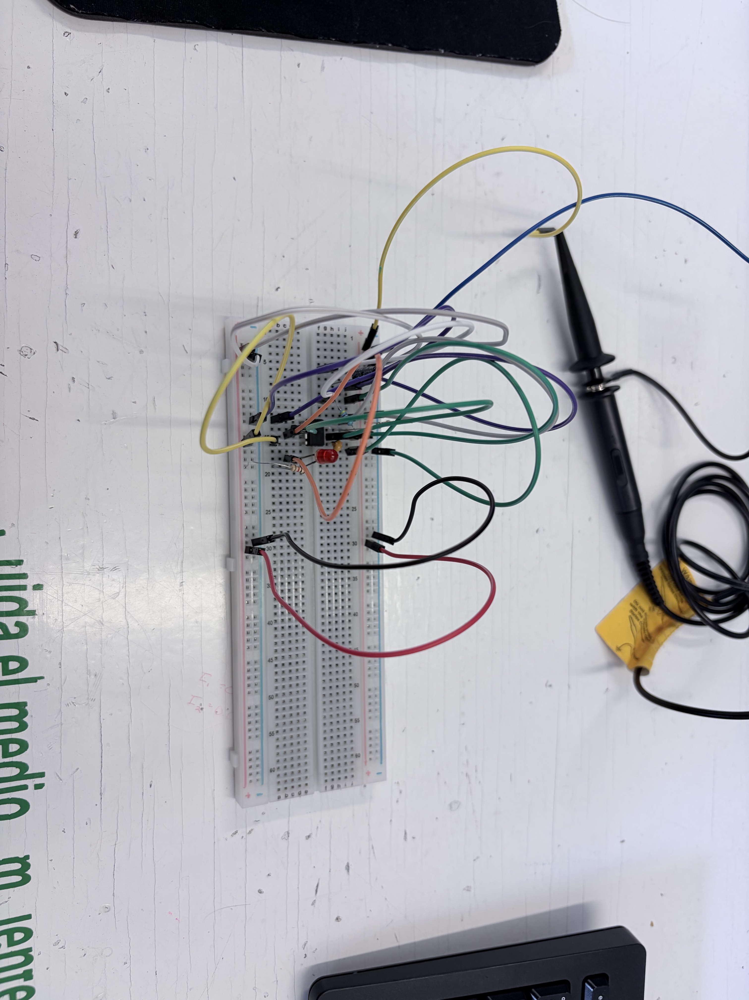
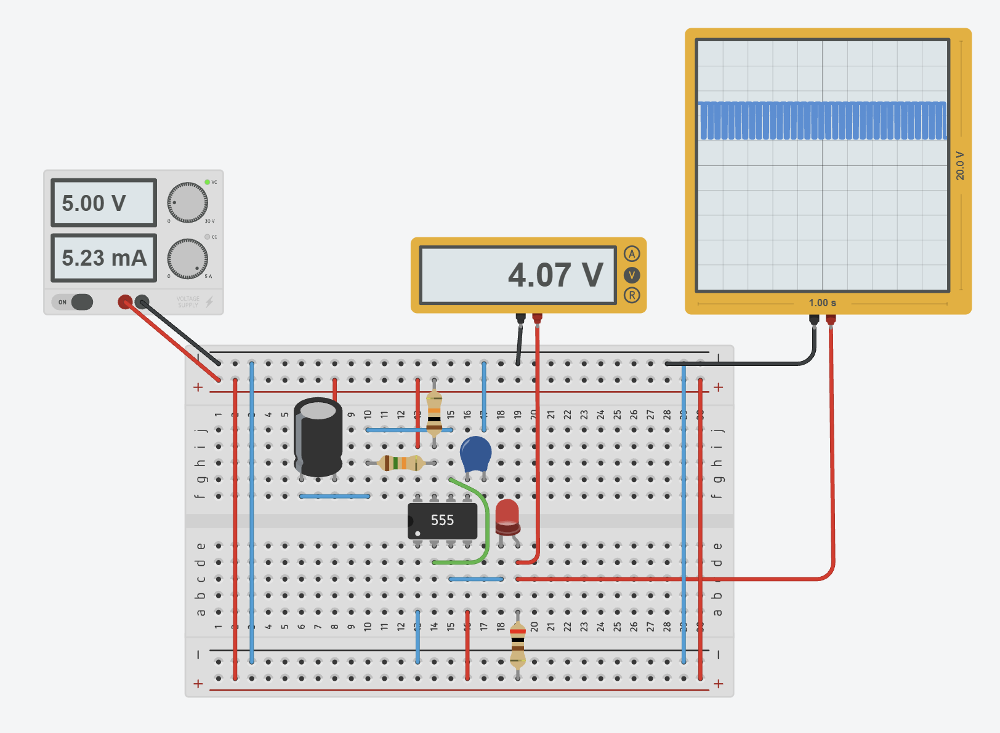

# Sesión 1 — 555 en astable

## Objetivos
- Construir un oscilador que haga parpadear un LED ✅
- calcular su frecuencia y duty teóricos, medirlos y comparar ✅
 
## Materiales
• (1×) NE555 (DIP-8)
• (1×) LED
• (1×) Resistor para LED (330 Ω o 470 Ω)
• (2×) Resistores temporizadores: ,
    ◦ RA = 1kΩ
    ◦ RB = 10kΩ
• (1×) Capacitor de temporización:
    ◦ C = 100µF (electrolítico)
    ◦ C = 100nF (cerámico)
• (1×) Capacitor 10 nF para pin 5 (CTRL) → estabilidad
• Protoboard, cables, fuente 5V regulada

## Desarrollo

| Magnitud | Teórico | Medido | % error |
| --- | --- | --- | --- |
| Vcc (V) | 5.0 | 5.0 | 0% |
| V de salida en alto (V) | ≈ Vcc - 1.5   5.0 - 1.5 = 3.5 | 4.40 | 25.71% |
| Frecuencia (Hz) | 0.69 | 1.187 | 72.02% |
| Duty (%) | 52.4 | 95.58 | 82.40% |
| I de LED (mA) | (Vout - Vf) / 330   (5.0 - 3.5) / 330 = 4.54 | 0.879 | 80.63% |

## Fallas
- **Síntoma:** Los valores medidos en el circuito salieron con un porcentaje de error muy alto en comparación con los valores teóricos, además de que el LED del timer parpadeaba más lento y con menos luz que al principio.
- **Cómo lo encontré:** Al comparar la tabla de resultados y volver a conectar el circuito, notamos la diferencia en la luz del LED y comparamos los componentes que usamos con los datos que se usaron para el cálculo teórico.
- **Solución:** En esta práctica no modificamos el circuito porque no contábamos con otros componentes ahí mismo. Nuestra solución fue analizar el problema; identificamos que el alto porcentaje de error se debió a la diferencia entre los valores teóricos y los componentes reales usados.

## Aprendizajes
En esta práctica aprendimos a usar correctamente el osciloscopio, cambiando a DC y midiendo el valor en alto (high), la frecuencia y el duty cycle sin confundirnos con los picos de la señal. También nos dimos cuenta de cómo cambian las mediciones entre la teoría y la realidad, porque usar resistencias y capacitores un poco diferentes puede cambiar bastante los resultados finales.

## Siguiente paso
Para las siguientes prácticas buscamos entender mejor cómo afecta cambiar el tamaño de una resistencia o un capacitor en el circuito. Así ya sabremos qué esperar cuando los datos de las simulaciones no coincidan tanto con lo que medimos en clase.