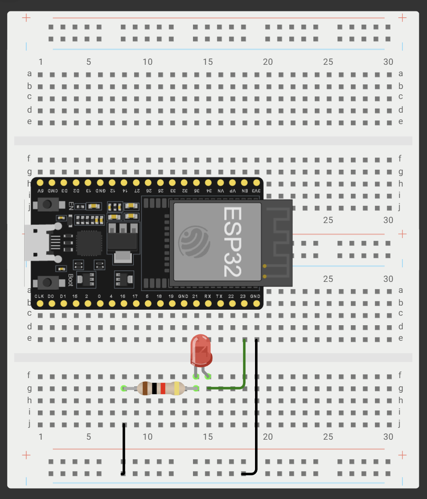
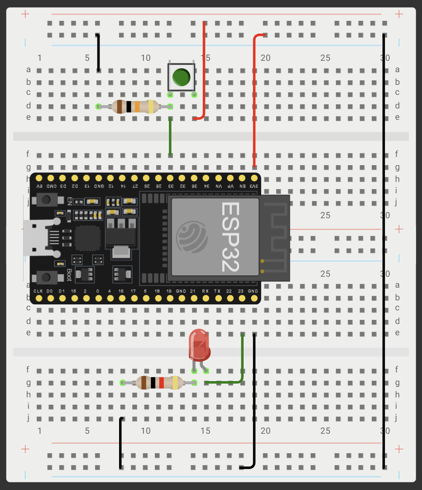
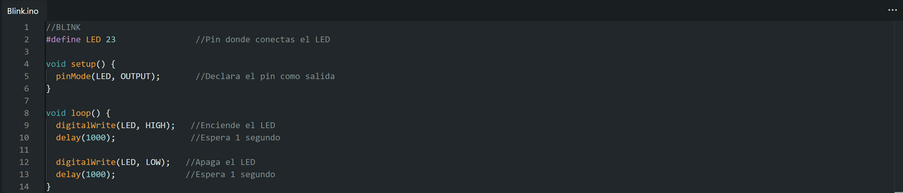
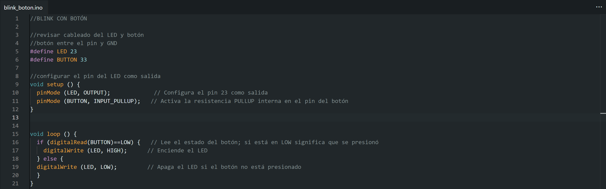
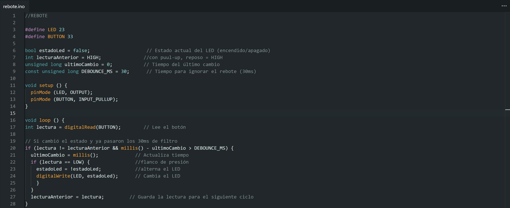

# Sesión 2 — ESP32: Salida, Entrada & Antirrebote

## Objetivos
- **BLINK (salida digital):** ✅ 
    ◦ LED externo en GPIO23 parpadeando a 1 Hz.
- **BLINK con botón (entrada digital):** ✅
    ◦ El LED enciende mientras el botón está presionado (INPUT_PULLUP).
- **TOGGLE con antirrebote:** ✅
    ◦ Cada presión del botón alterna el LED.
    ◦ Sin delay().

 
## Materiales
- (1×) ESP32 DevKit V1 (WROOM-32)  
- (1×) Cable USB de datos  
- (1×) LED + (1×) resistor 220 Ω  
- (1×) Push button  
- (1×) Resistor 10 kΩ (opcional)  
- Protoboard y jumpers  

## Desarrollo
**Esquemáticos**  
{ width=50% }  
*Esquemático de conexión BLINK*  

{ width=50% }  
*Esquemático de conexión BLINK CON BOTÓN Y TOGGLE*  

**Códigos**  
{ width=50% }  
*Código implementado de BLINK*  

{ width=50% }  
*Código implementado de BLINK CON BOTÓN*  

{ width=50% }  
*Código implementado de TOGGLE*  

**Demostraciones en Video**  
[*Demostración de funcionamiento: BLINK*](./img_practica_2/blink.mp4)  

[*Demostración de funcionamiento: BLINK CON BOTÓN*](./img_practica_2/blink_boton.mp4)  

[*Demostración de funcionamiento: TOGGLE*](./img_practica_2/rebote.mp4)  

**Explicación:**  
*¿Qué es el rebote de un botón?* 
--  
*¿Por qué con INPUT_PULLUP la lógica queda invertida?* 
--  

## Fallas
- **Síntoma:** --
- **Cómo lo encontré:** --
- **Solución:** --

## Aprendizajes
--

## Siguiente paso
--