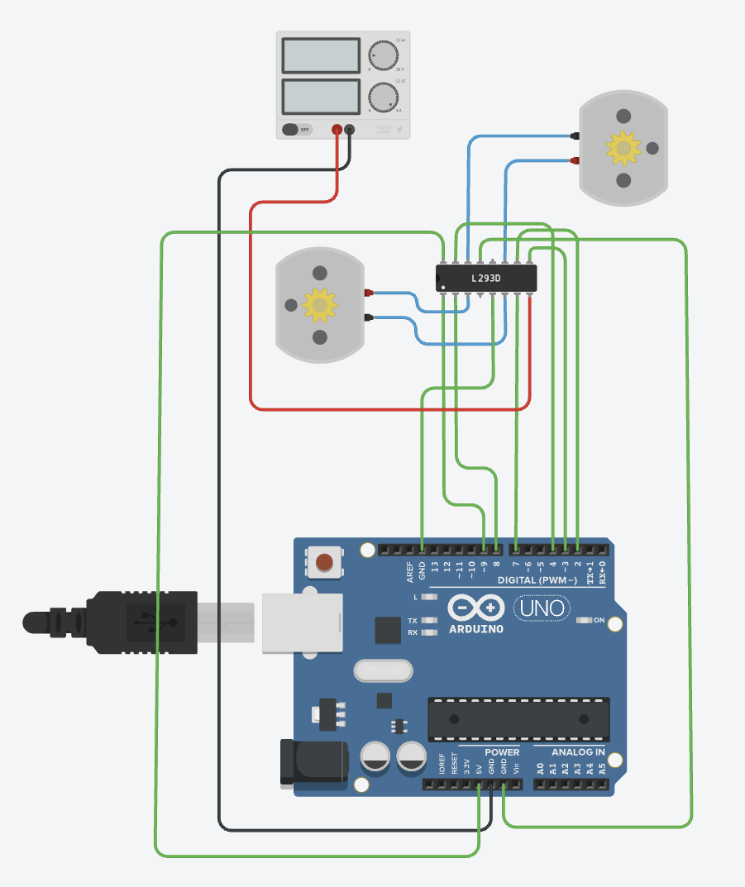
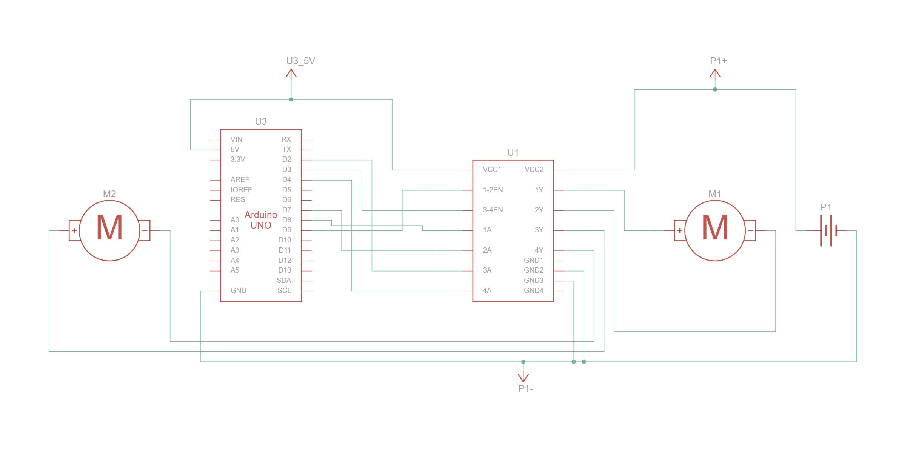
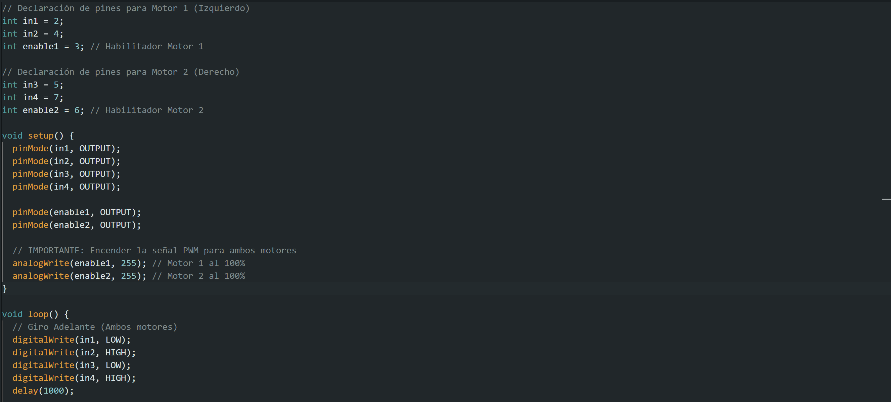
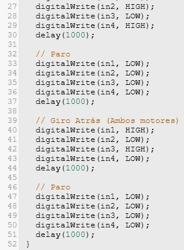
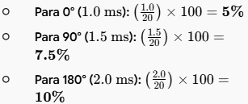
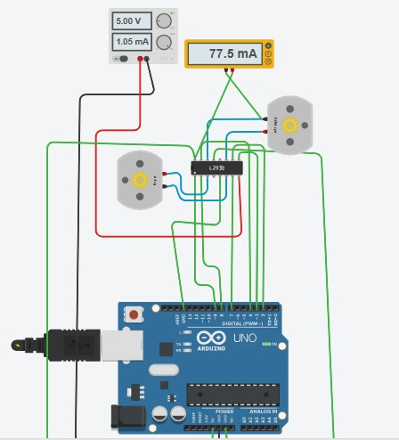

# Sesión 3 — Motor DC, Puente H & Servo

## Objetivos
- **Dirección y velocidad (motor DC):** ✔️  
    ◦ Motor gira en ambos sentidos controlado por in1/in2.  
    ◦ Control de velocidad por PWM (mínimo 3 velocidades distintas).  
    ◦ Identifica el PWM mínimo de arranque del motor.  
- **Prueba de carga:** ✔️  
    ◦ Mide corriente en arranque y en giro libre (multímetro en serie).  
    ◦ Compara ambos valores, ¿cuál es mayor y por qué?  
- **Servo:** ✔️  
    ◦ Demuestra 3 posiciones (0°, 90°, 180°). 
    ◦ Muestra el cálculo de duty para cada una.

 
## Materiales
- (1×) ESP32 DevKit V1  
- (1×) Driver TB6612 (puente H)  
- (1–2×) Motor DC TT con caja reductora  
- (1×) Servo SG90 (o similar)  
- (1×) Potenciómetro 10 kΩ  
- Fuente/batería para motores (separada del ESP32, GND común)  
- Multímetro  
- Protoboard y jumpers  

## Desarrollo
**Circuito y Esquemático**  
{ width=50% }  
*Circuito de Control de Motores DC, Puente H y Servomoto*  

{ width=50% }  
*Esquema de Motores DC, Puente H y Servomoto*  

**Códigos**  
{ width=50% }  
*Codigo implementado para Motores DC, Puente H y Servomoto (Parte 1)*  

{ width=50% }  
*Codigo implementado para Motores DC, Puente H y Servomoto (Parte 2)*  

**Demostraciones en Video**  
[*Demostración del funcionamiento*](./img_practica_3/funcion.mp4)  

**Explicación:**  
En esta práctica se llevó a cabo la simulación y el control de dos motores DC mediante una tarjeta Arduino UNO y un módulo de puente H (L293D) en la plataforma Tinkercad, donde el circuito y su programación permitieron gestionar de manera precisa el funcionamiento de los motores al enviar señales digitales para activar el movimiento en un sentido, ejecutar una parada temporal y posteriormente invertir la dirección del giro.

{ width=50% }  
*Calculos del Duty*  

La corriente de arranque es mayor porque al inicio el motor se comporta casi como un cortocircuito (sin fuerza electromotriz opuesta), demandando máxima energía para romper el estado de reposo

{ width=50% }  
*corriente en giro libre*  

## Fallas
- **Síntoma:** Al iniciar la simulación en Tinkercad, ninguno de los dos motores DC presentaba movimiento , a pesar de que el código parecía estar ejecutando las funciones de movimiento. Durante las pruebas, solo uno de los dos motores DC giraba, mientras que el otro permanecía completamente inactivo a pesar de recibir la orden desde el programa.
- **Cómo lo encontré:** Con el apoyo de herramientas de inteligencia artificial para auditar la estructura del programa y la orientación de la docente, se verificó que el cableado físico del circuito fuera correcto. Esto permitió aislar la falla y detectar que el problema radicaba exclusivamente en el código. Existía una discrepancia en la declaración de las variables de entrada del motor inactivo; el código apuntaba a pines de salida del Arduino distintos a los que estaban conectados físicamente al motor.
- **Solución:** Se redefinieron y corrigieron los pines de entrada del motor en el código fuente para que coincidieran exactamente con el cableado del circuito, logrando que el Arduino reconociera y controlara correctamente ambos motores. Tras cargar el código corregido y ejecutar la simulación, el motor respondio inmediatamente, logrando realizar la secuencia de avance, paro y reversa de manera automatizada y continua.

## Aprendizajes
Aprendimos que funciona como un puente entre el Arduino y los motores, permitiendo controlar la dirección en la que giran (adelante o atrás) y frenarlos de forma segura. del mismo modo, aprendimos que funciona como un puente entre el Arduino y los motores, permitiendo controlar la dirección en la que giran (adelante o atrás) y frenarlos de forma segura.

## Siguiente paso
Para dominar el control exacto de velocidad y dirección, el siguiente paso en la programación es entender dos conceptos clave de Arduino: las variables PWM para la velocidad y las funciones personalizadas para dar instrucciones claras al motor.