# Sesión 4 — Sensores 101

## Objetivos
- **Potenciómetro:** ✔️  
    ◦ Motor gira en ambos sentidos controlado por in1/in2.  
    ◦ Control de velocidad por PWM (mínimo 3 velocidades distintas).  
    ◦ Identifica el PWM mínimo de arranque del motor.  
- **LM35 (calibración):** ✔️  
    ◦ Mide corriente en arranque y en giro libre (multímetro en serie).  
    ◦ Compara ambos valores, ¿cuál es mayor y por qué?  
- **Filtro:** ✔️  
    ◦ Demuestra 3 posiciones (0°, 90°, 180°). 
    ◦ Muestra el cálculo de duty para cada una. 
- **MPU6050:** ❌  
    ◦ Lectura de roll y pitch en al menos 3 inclinaciones distintas. 
    ◦ Detección de al menos un impacto con umbral ajustado.  
    (No realizada por falta del material)

## Materiales
- (1×) ESP32 DevKit V1  
- (1×) Potenciómetro 10 kΩ  
- (1×) LM35  
- (1×) Acelerómetro MPU6050 (módulo I2C)  
- Termómetro de referencia (ambiental o infrarrojo del laboratorio)  
- Protoboard y jumpers  

## Desarrollo
### 1. Curvas de calibración del potenciómetro (ADC vs. ángulo/posición) y del LM35 (T referencia vs. ADC), con la recta ajustada.

Con la recta ajustada: La práctica pide leer el potenciómetro mediante el ADC del ESP32 y relacionar la lectura con posición o ángulo. El ESP32 utiliza valores ADC de 0 a 4095 y la presentación recomienda usar pines ADC1.

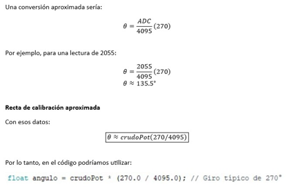{ width=40% } { width=40% }  

*Eje X: lectura ADC, Eje Y: ángulo de referencia.*  

---------------------------------------------------------------------------------------------------------------------------

### 2.Tablas de datos

| Punto | Ángulo de referencia (°) | Lectura ADC | Ángulo calculado (°) | Error (°) |
| :--- | :---: | :---: | :---: | :---: |
| **Mínimo** | 0° | 25 | 1.6° | +1.6° |
| **25%** | 67.5° | 1015 | 66.9° | -0.6° |
| **50%** | 135° | 2055 | 135.5° | +0.5° |
| **75%** | 202.5° | 3060 | 201.8° | -0.7° |
| **Máximo** | 270° | 4080 | 269° | -1° |

*Recorrido de 0° a 270°*  

| Punto | Treferencia (°C) | Lectura ADC | Tcalculada (°C) | Error (°C) |
| :--- | :---: | :---: | :---: | :---: |
| **Ambiente** | 24.0 °C | 296 | 23.85 °C | -0.15 °C |
| **Entre dedos** | 30.0 °C | 374 | 30.14 °C | +.14 °C |
| **Lámpara** | 42.0 °C | 518 | 41.74 °C | -0.26 °C |
| **Lata fría** | 18.0 °C | 220 | 17.73 °C | -0.27°C |
| **Otro** | 68.3 | 848 | 68.33 | mismo |

*Temperatura detectada*  

Para tener los datos de las tablas, fue necesario realizar el circuito físico e instalar diferentes programas, para que el Arduino detectara el Esp35, una vez lo detectó, fue necesario realizar el código para que este funcionara y mostrara los datos necesarios

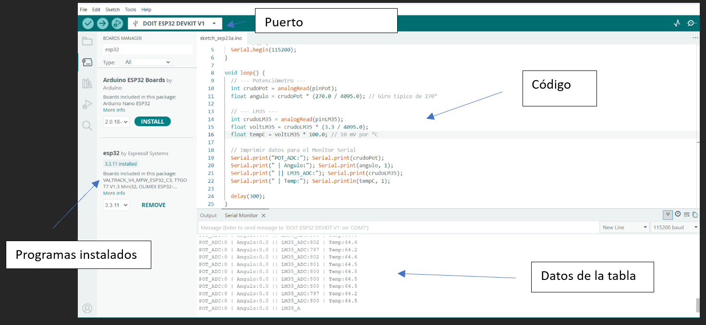{ width=40% } 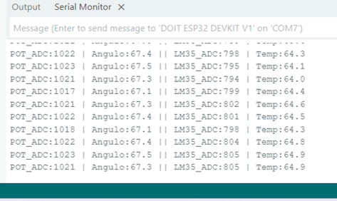{ width=40% }  

*Ángulo cambia a 67.5 y marca diferente ADC*  

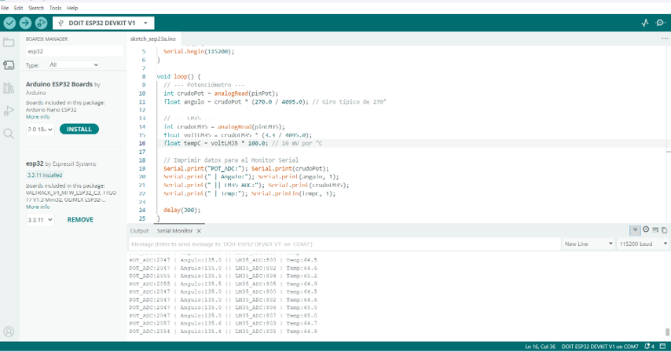{ width=40% }  
*Ángulo de 135.5, ADC 2055*  

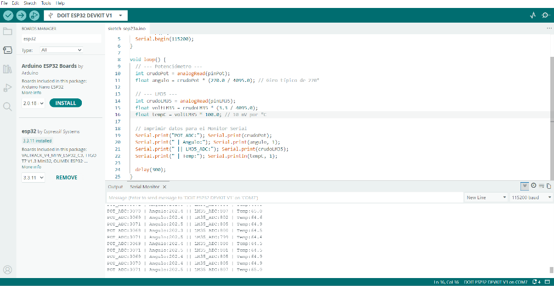{ width=40% }  
*Ángulo: 202.5*  

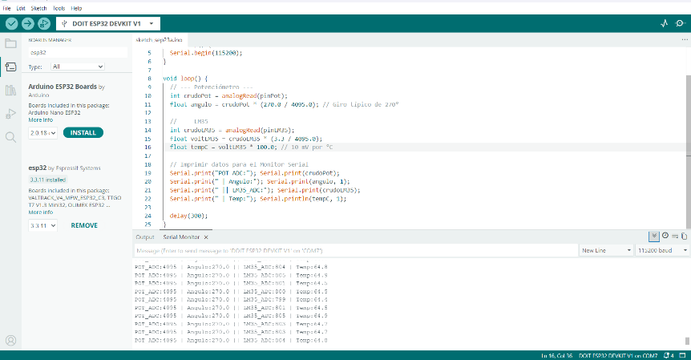{ width=40% }  
*Ángulo: 270*  

---------------------------------------------------------------------------------------------------------------------------

**Tabla del LM35**  
El LM35 entrega aproximadamente $10\text{ mV}$ por cada $\text{°C}$: a $25\text{ °C}$, su salida es $0.25\text{ V}$.

$$
T\,[\text{°C}] = V_{out} \times 100
$$

Además:

$$
V = \frac{ADC}{4095} \times 3.3
$$

Por tanto:

$$
T = \frac{ADC}{4095} \times 3.3 \times 100
$$

Por ejemplo, para $\text{ADC} = 374$:

$$
V = \frac{374}{4095}(3.3)
$$

$$
V \approx 0.3014\text{ V}
$$

Entonces:

$$
T = 0.3014(100)
$$

$$
T \approx 30.14\text{ °C}
$$

---------------------------------------------------------------------------------------------------------------------------

**LM35**  
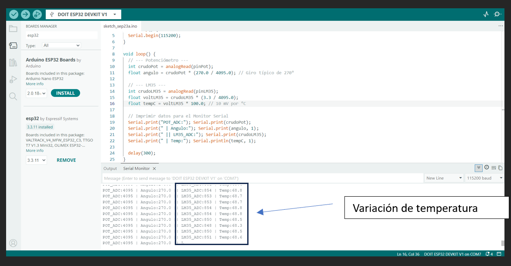{ width=40% }  
*Temperatura: 68.2, ADC:842*  

Después de obtener cinco puntos de referencia se realizó un ajuste lineal. La ecuación encontrada fue aproximadamente T=0.08007ADC+0.263. Al utilizar esta ecuación, las lecturas permanecieron cercanas a las temperaturas de referencia y se redujo parte del error producido por las variaciones del ADC.

---------------------------------------------------------------------------------------------------------------------------

### 3. Captura del Serial Plotter mostrando señal cruda vs. filtrada, con la elección de N justificada.

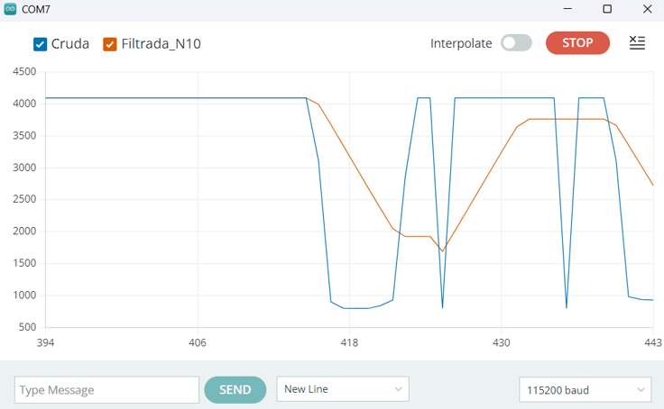{ width=40% }  
*Serial Plotter: N = 10*  

**Señal Cruda (Azul):** Muestra cambios abruptos e instantáneos (escalones verticales) cuando giras el potenciómetro o cambia la lectura, además de picos ruidosos en los extremos altos y bajos.
Señal Filtrada (Naranja): Realiza una pendiente suave (rampa). Elimina los picos repentinos de ruido y atenúa la fluctuación brusca, a costa de un pequeño retraso suave en el tiempo de respuesta.  

En la gráfica se observa que la señal cruda presenta pequeñas fluctuaciones aunque la temperatura permanezca prácticamente constante. Después de aplicar un promedio móvil con N = 10, las variaciones disminuyen y la señal se mantiene más estable.  

| N | RUIDO | SUAVIDAD | VELOCIDAD DE RESPUESTA | RESULTADO |
| :--- | :--- | :--- | :--- | :--- |
| **3** | Moderado | Bajo | Muy rápida | Sigue teniendo variaciones |
| **10** | Bajo | Bueno | Rápida | Buen equilibrio |
| **50** | Muy bajo | Muy alta | Lenta | Demasiado retraso |
 

La presentación pide probar:

$$
N = 3, \quad N = 10, \quad N = 50
$$

Pusimos **N = 10**  
**Justificación:** Se eligió una ventana de promedio móvil de N = 10 porque permitió disminuir considerablemente el ruido de la lectura sin generar un retraso demasiado grande. Con N = 3 todavía se observaban variaciones considerables, mientras que con N = 50 la señal era más estable pero respondía lentamente a los cambios de temperatura.
Eso coincide con la idea de la presentación: una ventana más grande suaviza más, pero genera mayor retraso.  

---------------------------------------------------------------------------------------------------------------------------

### 4. Código comentado
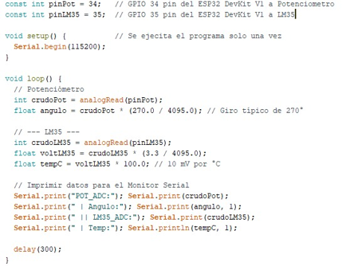{ width=40% }  

---------------------------------------------------------------------------------------------------------------------------

### 5. Esquemáticos con conexiones.
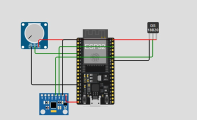{ width=40% } 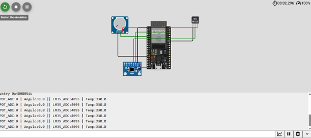{ width=40% }  

---------------------------------------------------------------------------------------------------------------------------

**MPU6050**  
La parte correspondiente al MPU6050 no pudo realizarse físicamente debido a que no se contaba con el módulo durante la práctica. El resto de la práctica se realizó utilizando el potenciómetro y el sensor de temperatura LM35. De acuerdo con el material, el MPU6050 se comunica mediante I2C usando SDA en GPIO 21 y SCL en GPIO 22.  

---------------------------------------------------------------------------------------------------------------------------

### 6. Evidencias del armado físico
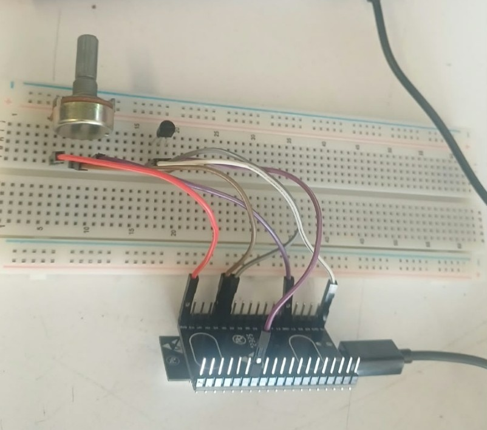{ width=40% }  

---------------------------------------------------------------------------------------------------------------------------

### 7.Bitácora: qué falló, qué resultó inesperado (¿el ADC es tan lineal como prometía la fórmula teórica?)
Durante el desarrollo de la práctica se realizaron lecturas analógicas utilizando Arduino y el ESP32. Primero se conectó el potenciómetro y se observó que la lectura cambiaba conforme se giraba la perilla. Aunque teóricamente se esperaba que la relación entre posición y ADC fuera completamente lineal, aparecieron pequeñas diferencias entre los valores esperados y los obtenidos.  

Posteriormente se conectó el LM35. Fue necesario verificar cuidadosamente sus terminales, ya que el sensor debe conectarse a 3.3 V y una conexión incorrecta puede provocar que se caliente o que se queme ya que principalmente lo habíamos conectado a 5V y este se quemó y tuvimos que reemplazarlo. La salida del sensor se conectó al GPIO 35 del ESP32, como se indica en la práctica.  

Al mantener el LM35 aparentemente a una temperatura constante se observó que las lecturas del ADC no permanecían exactamente iguales. Los valores cambiaban ligeramente entre una medición y otra. Esto corresponde al ruido de medición mencionado en la presentación.   

Para reducir estas variaciones se implementó un promedio móvil. Se compararon ventanas de N = 3, N = 10 y N = 50. Con N = 3 la señal respondía rápidamente pero todavía presentaba variaciones. Con N = 50 la señal era muy estable, aunque reaccionaba más lentamente. Por ello se seleccionó N = 10 como un equilibrio entre estabilidad y velocidad de respuesta.  

También se realizó una calibración del LM35 tomando diferentes puntos de temperatura y comparándolos con una referencia. A partir de estos datos se obtuvo una recta de calibración para convertir directamente la lectura ADC a temperatura.  

Una de las observaciones principales fue que el comportamiento real del ADC no es completamente idéntico al modelo teórico. Las pequeñas diferencias observadas muestran por qué es conveniente realizar una calibración experimental en lugar de depender únicamente de la ecuación ideal.  

La sección correspondiente al MPU6050 no pudo realizarse físicamente porque no se contaba con este sensor durante el desarrollo de la práctica.  

Uno de los principales obstáculos fue el estado del cable USB de conexión. Al inicio de la práctica, se experimentaron desconexiones intermitentes entre la placa ESP32 y la computadora. Al inspeccionar el hardware, se detectó un falso contacto y un posible cortocircuito en la base del conector USB, donde la cubierta protectora del cable estaba rota. Esto no solo dificultaba la subida del código y la visualización de datos en el Monitor Serial, sino que representaba un riesgo para la integridad del puerto USB de la computadora. Fue necesario asegurar el cable en una posición específica para poder estabilizar la conexión y proceder con las lecturas.  

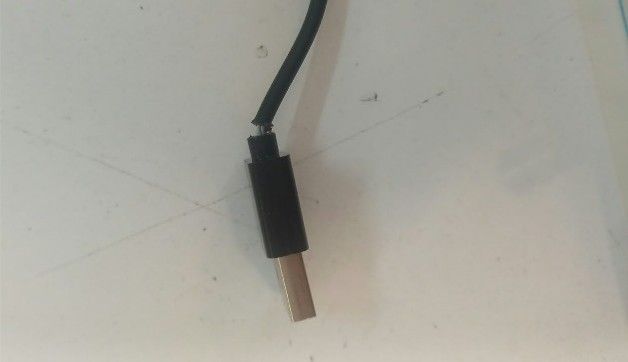{ width=40% }  

Lamentablemente, no se pudo realizar la práctica con el MPU6050. Primero, debido a que no se contaba físicamente con el sensor durante el desarrollo. En segundo lugar, los intentos de simulación en la plataforma Wokwi fallaron; el servidor de compilación presentaba una carga alta constante ("Build server load"), lo que impedía que el proyecto se ejecutara y las lecturas de los sensores no se generaban, mostrando la simulación en un estado de pausa indefinida.  

{ width=40% }  