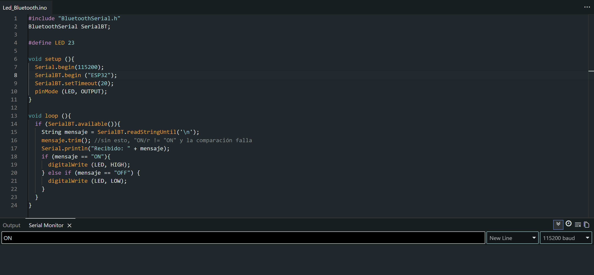
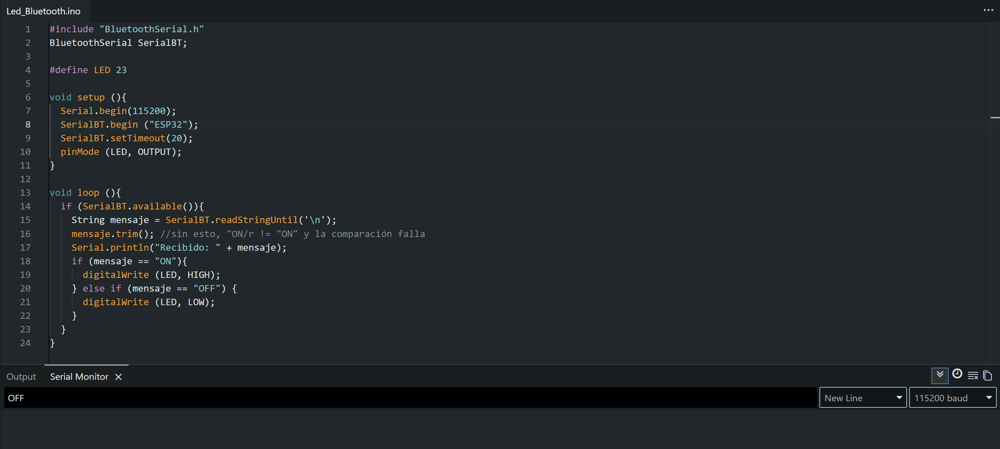
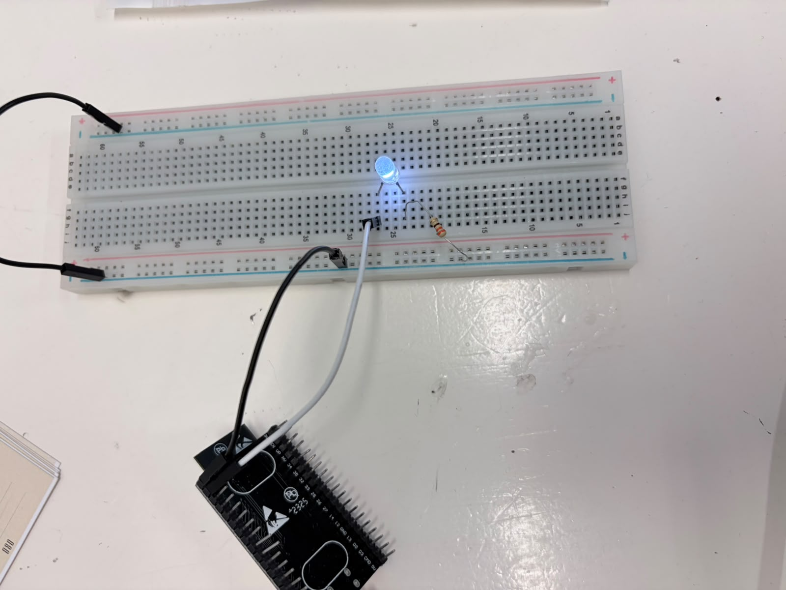

# Sesión 5 — Comunicación Bluetooth

## Objetivos
- **Enlace Bluetooth:** ✔️  
    ◦ SerialBT.begin() funcionando, comandos recibidos y mostrados en el Monitor Serial.  
    ◦ Verificar que el emparejamiento con el celular es estable antes de avanzar.
- **LED con Bluetooth:** ✔️  
    ◦ Control de un LED con los comando ON/OFF desde el celular.  
    ◦ Uso correcto de mensaje.trimn(), sin esto la comparación falla.
- **Protocolo de comando:** ✔️  
    ◦ Documentar la tabla comando ➔ acción (mínimo ON/OFF).
- **Experimento de latencia:** ❌  
    ◦ Probar el control con delay(100) en el loop y sin él, sentir la diferencia a proposito  
    (No realizada porque no lo vi jeje)

 
## Materiales
- (1×) ESP32 DevKit V1  
- (1×) Cable USB de datos  
- (1×) LED + (1×) resistor 220 Ω  
- Breadboard y jumpers  
- Celular Android (o PC con Bluetooth) + app "Serial Bluetooth Terminal"

## Desarrollo
**Protocolo y Código:**  
{ width=50% }  
*Código en el IDE de Arduino y prueba del comando ON en el Monitor Serial*  

{ width=50% }  
*Código en el IDE de Arduino y prueba del comando OFF en el Monitor Serial*  

| Comando (Bluetooth) | Acción en el ESP32 | Estado del LED (Pin 23) |
| :---: | :--- | :---: |
| **`ON`** | Pone el pin 23 en nivel alto (`HIGH`) | Encendido |
| **`OFF`** | Pone el pin 23 en nivel bajo (`LOW`) | Apagado |

**Circuito**  
{ width=50% }  
*Armado del circuito en protoboard*  

**Demostraciones en Video**  
[*Emparejamiento y envío de comandos vía Bluetooth*](./img_practica_5/funcion.mp4)  

**Explicación:** 

    - **Envío de la señal:** Las instrucciones de texto (ON/OFF) se ingresan en el Monitor Serial de la computadora y se transmiten por aire vía Bluetooth hacia el ESP32.

- **Lectura y limpieza:** Al recibir la señal, el código usa readStringUntil('\n') para capturar el texto y la función mensaje.trim() para eliminar espacios o caracteres invisibles que puedan interrumpir la lectura.   

- **Evaluación lógica:** Mediante una estructura condicional if, el sistema verifica el mensaje si recibe "ON" asigna nivel alto (HIGH) al pin 23 para encender el LED, si recibe "OFF" asigna nivel bajo (LOW) para apagarlo. 

- **Gestión de puertos COM:** Para lograr la comunicación inalámbrica seleccionamos en el IDE el puerto virtual Bluetooth (COM8), reservando el puerto USB físico (COM5) únicamente para la carga del programa.

## Fallas
- **Síntoma:** El programa compilaba sin errores pero el ESP32 no respondía a los comandos enviados por Bluetooth, además de que la tarjeta no estaba vinculada al sistema.
- **Cómo lo encontré:** Se pidió apoyo a la profesora para revisar la falla y se identificó que la transmisión se estaba enviando al puerto USB (COM5) en lugar del canal Bluetooth.
- **Solución:** Se vinculó el ESP32 por Bluetooth a la computadora y se cambió en el IDE de Arduino la salida de puerto al COM8 para enviar la señal inalámbricamente.

## Aprendizajes
En esta práctica se aprendió a enviar y procesar comandos de texto vía Bluetooth para controlar un componente físico, utilizando el Monitor Serial como una interfaz activa de control y aplicando la función trim() para la limpieza de datos. Asimismo, se comprendió la diferencia técnica entre el puerto USB físico asignado a la carga de código (COM5) y el puerto virtual utilizado para la transmisión por bluetooth (COM8).

## Siguiente paso
Como siguiente paso, se buscará aplicar esta transmisión inalámbrica a un proyecto de mayor complejidad, como el control de un carrito robótico.