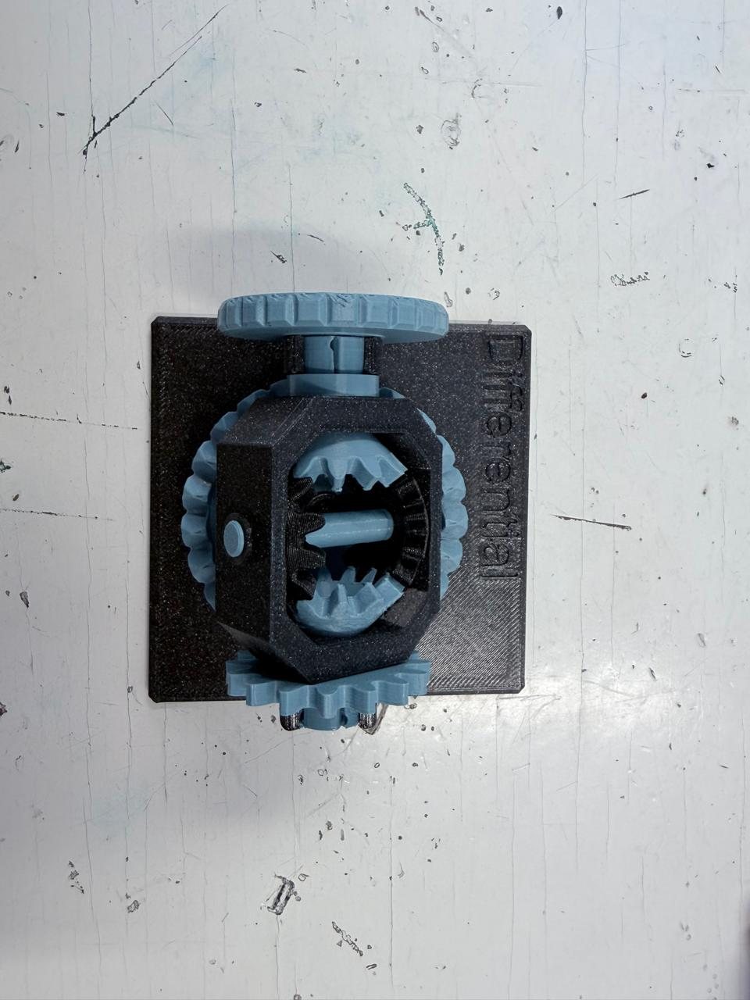
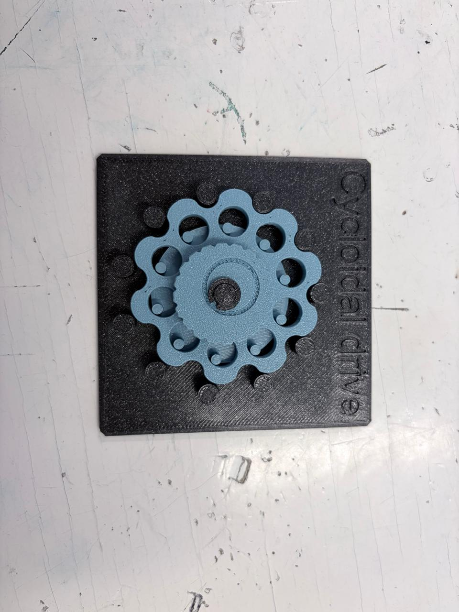
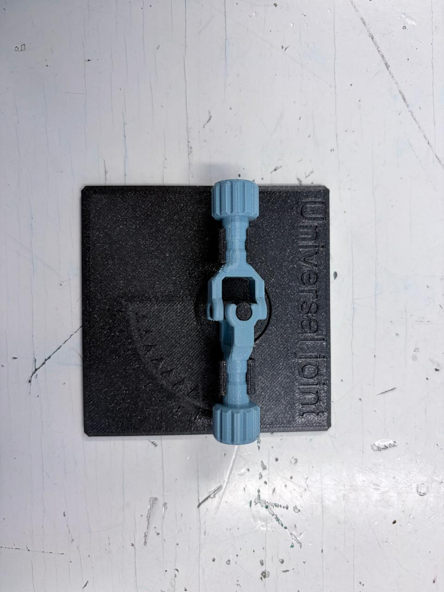
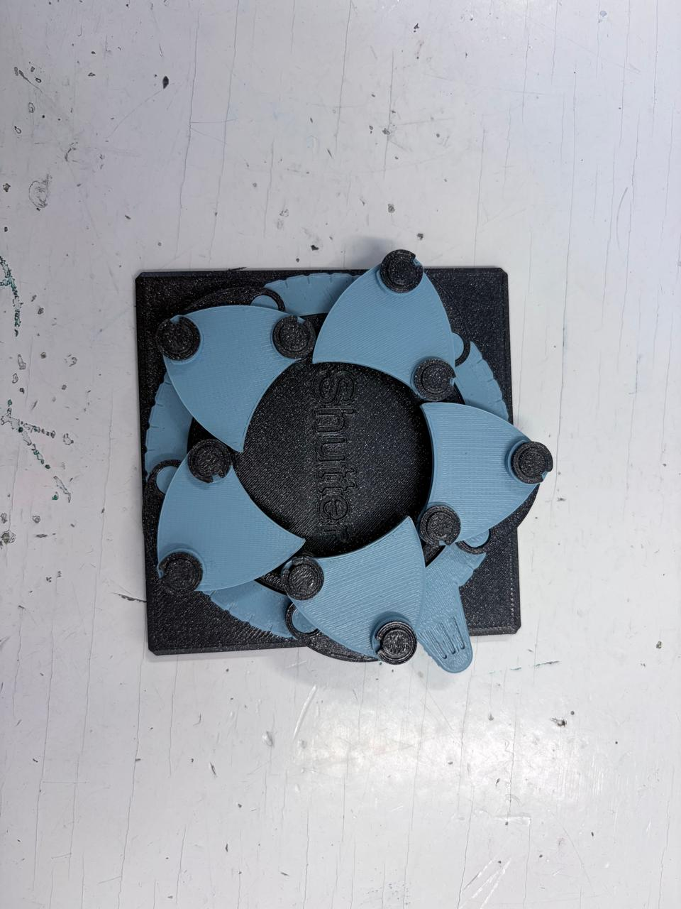
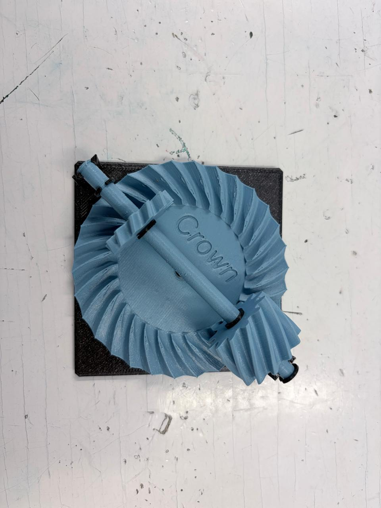
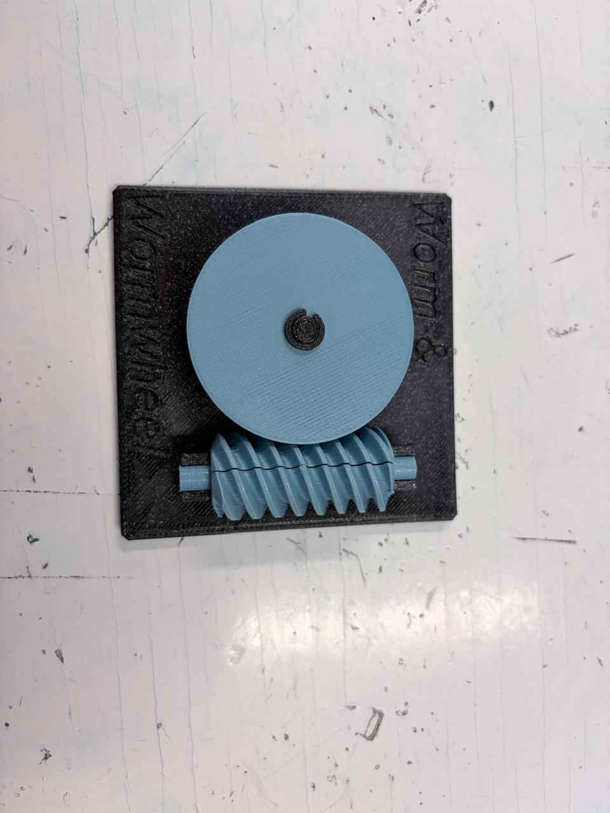
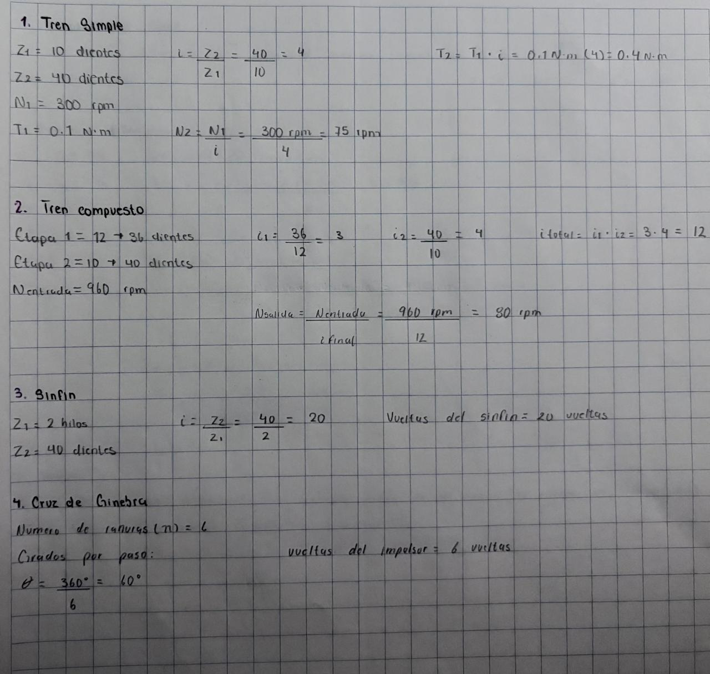
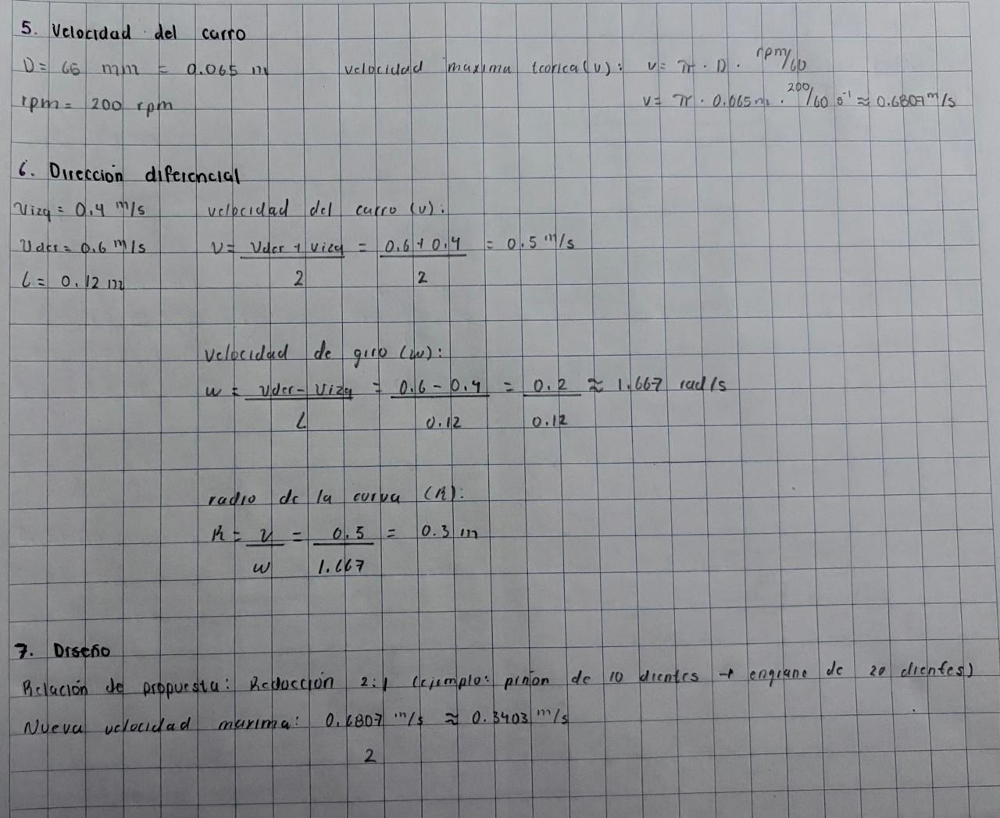

# Sesión 6 — Mecanismos aplicados

## Ficha de estación

| Estación | ¿Qué transforma? | Relación estimada | ¿Reversible o autobloqueante? | ¿Dónde lo has visto? | ¿Para qué sirve en el carro o en un proyecto? |
| :---: | :--- | :---: | :---: | :--- | :--- |
| **Diferencial** | Velocidad ↔ Par y Cambio de eje (gira a 90°) | 3:1 a 4:1 | Reversible | Eje de autos y camionetas | Permite que las ruedas giren a diferente velocidad en las curvas |
| **Cicloidal** | Velocidad ↔ Par (mucha fuerza, poca velocidad) | 30:1 a 100:1 | Autobloqueante | Brazos robóticos industriales | Articulaciones de robots o en un *winch* para levantar carga |
| **Cardán** | Cambio de eje (unión entre ejes desalineados) | 1:1 | Reversible | Flecha de transmisión y columna de dirección | Transmitir movimiento del motor a las ruedas traseras con la suspensión en movimiento |
| **Obturador** | Continuo ↔ Intermitente (abrir/cerrar paso) | 1:1 por ciclo | Reversible | Cámaras fotográficas y cuerpo de aceleración | Dosificar la entrada de aire al motor mediante la mariposa de aceleración |
| **Cremallera y piñón** | Rotación ↔ Traslación (giratorio a lineal) | 12:1 a 18:1 | Reversible | Dirección de autos y portones mecánicos | Convertir el giro del volante en movimiento horizontal para orientar las ruedas |
| **Cruz de Ginebra** | Continuo ↔ Intermitente (movimiento a pasos) | 4:1 | Autobloqueante | Proyectores de cine y embotelladoras | Avanzar una banda transportadora paso a paso para ensamblar o llenar piezas |
| **Corona (Crown gear)** | Cambio de eje (transmisión a 90°) | 3:1 a 5:1 | Reversible | Carritos de pista (Scalextric) y juguetes | Transmitir la fuerza del motor al eje de las ruedas en ángulo recto |
| **Sinfín + corona** | Velocidad ↔ Par y Cambio de eje (90°) | 20:1 a 100:1 | Autobloqueante | Elevadores y clavijas de guitarra | Reducir mucha velocidad para ganar torque y evitar que la carga caiga por gravedad |

## Imagenes y videos

**Diferencial**  
{ width=50% }  

[*Demostración de funcionamiento: Diferencial*](./img_practica_6/diferencial.mp4)  

**Cicloidal**  
{ width=50% }  

[*Demostración de funcionamiento: Cicloidal*](./img_practica_6/cicloidal.mp4)  

**Cardán**  
{ width=50% }  

[*Demostración de funcionamiento: Cardán*](./img_practica_6/cardan.mp4)  

**Obturador**  
{ width=50% }  

[*Demostración de funcionamiento: Obturador*](./img_practica_6/obturador.mp4)  

**Cremallera y piñón**  
{ width=50% }  

[*Demostración de funcionamiento: Cremallera y piñón*](./img_practica_6/cremallera%20y%20piñón.mp4)  

**Cruz de Ginebra**  
{ width=50% }  

[*Demostración de funcionamiento: Cruz de Ginebra*](./img_practica_6/cruz%20de%20ginebra.mp4)  

**Corona (crown gear)**  
{ width=50% }  

[*Demostración de funcionamiento: Corona (crown gear)*](./img_practica_6/corona.mp4)  

**Sinfín + corona**  
{ width=50% }  

[*Demostración de funcionamiento: Sinfín + corona*](./img_practica_6/sinfin.mp4)  

## Ejercicios
{ width=70% }  
{ width=70% }  
